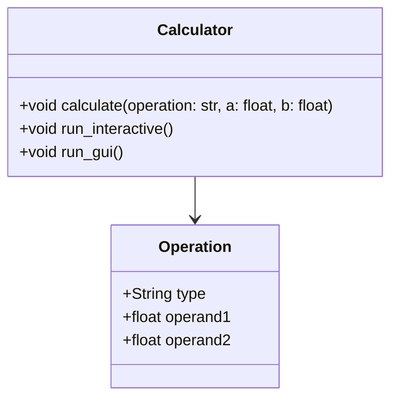

# Architecture Design Document (ADD)

## System Architecture  
The architecture of the system is designed in adherence to modern software engineering principles to ensure scalability and robustness.

### Architecture Overview  
- **Frontend**: Command Line Interface (CLI) and Graphical User Interface (GUI) are available for user interaction with the calculator functionalities.  
- **Backend**: Python script that processes calculator operations and manages inputs.
  
    Evidence Path: "calculator.py"

### Component Diagram  

### Database Schema  
Not applicable as the calculator does not interact with a database.

## Conclusion  
This ADD outlines the fundamental architecture that will support the development and deployment of the system, ensuring durability and performance.