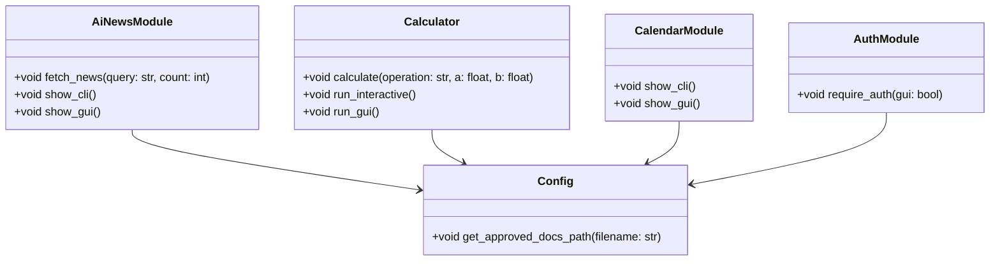

# Architecture Design Document (ADD)

## System Architecture  
The architecture of the system is designed in adherence to modern software engineering principles to ensure scalability and robustness.

### Architecture Overview  
- **Frontend**: Command Line Interface (CLI) and Graphical User Interface (GUI) are available for user interaction with functionalities: fetching AI news, performing calculations, displaying today's date, and user authentication.  
- **Backend**: Python scripts (`ai_news_module.py`, `calculator.py`, `calendar_module.py`, `auth_module.py`, `config.py`) that process requests and manage inputs.

### Components  
- `ai_news_module.py`: Responsible for fetching and displaying the latest AI news articles.  
- `calculator.py`: Handles various arithmetic operations and presents results.  
- `calendar_module.py`: Provides functionality to display today's date.  
- `auth_module.py`: Manages user authentication and session management.  
- `config.py`: Holds configuration settings, paths, and document requirements.  

### Component Diagram  

### Database Schema  
No database evidence.

## Conclusion  
This ADD outlines the fundamental architecture that will support the development and deployment of the system, ensuring durability and performance.