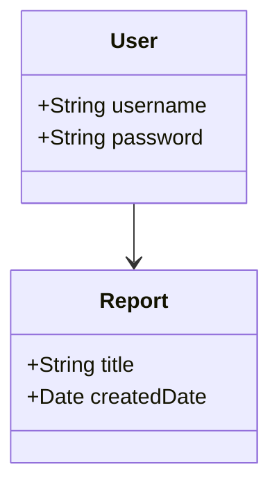

# Architecture Design Document (ADD)

## System Architecture  
The architecture of the system is designed in adherence to modern software engineering principles to ensure scalability and robustness.

### Architecture Overview  
- **Frontend**: React.js for building user interfaces.  
- **Backend**: Node.js with Express for managing API requests.  
- **Database**: PostgreSQL for data storage.

    Evidence Path: "docs/add.md"

### Component Diagram  


### Database Schema  
```mermaid
databaseEntity  
  entity User {  
    +String username  
    +String password  
  }
```

## Conclusion  
This ADD outlines the fundamental architecture that will support the development and deployment of the system, ensuring durability and performance.