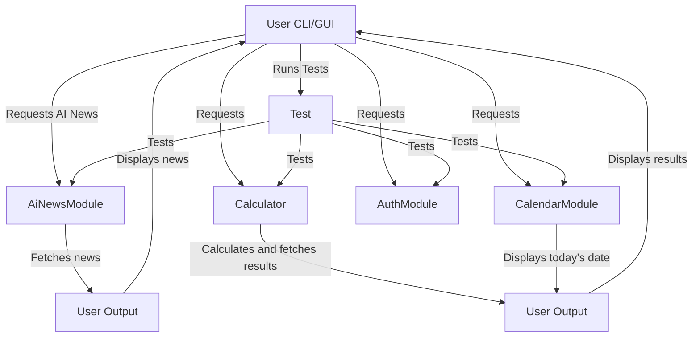
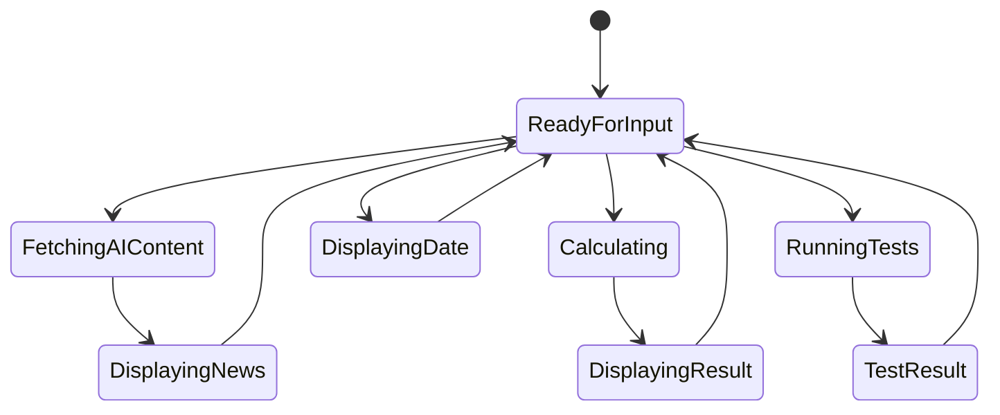
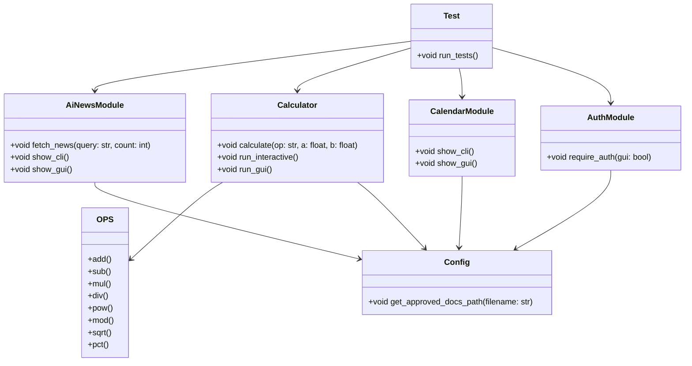

# Diagrams Preview

Open this file in Markdown preview (`Ctrl+Shift+V`) to view all diagrams.

<!-- AUTO-GENERATED by scripts/sync_diagrams_preview.py — do not edit manually -->

## Architecture

## State Machine

## Class Diagram

## Database Entity

> No database evidence.
