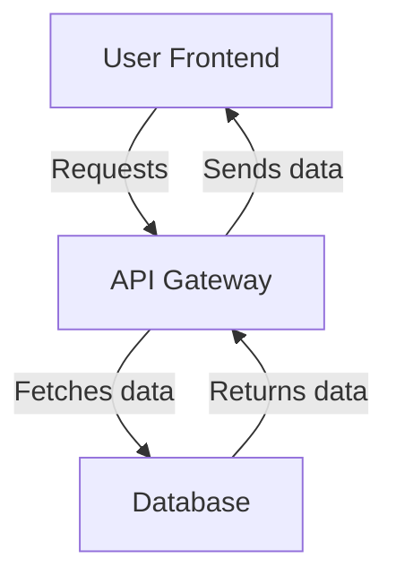
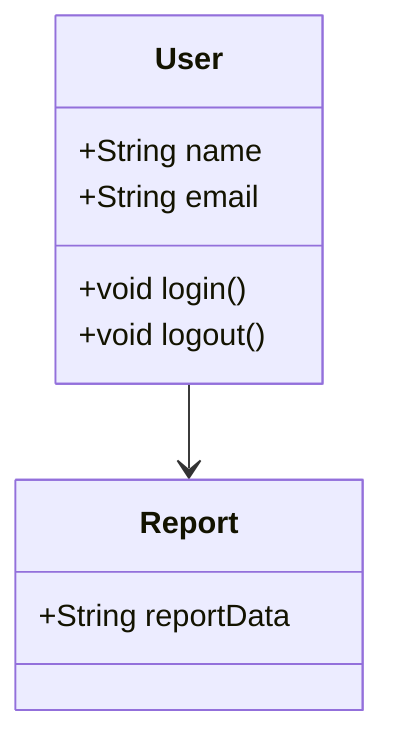
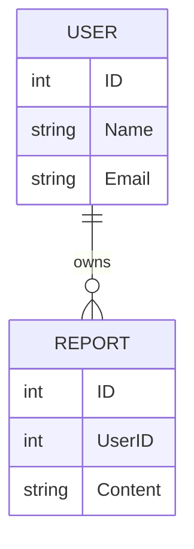
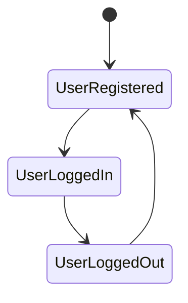

# Diagrams Preview

Open this file in Markdown preview (`Ctrl+Shift+V`) to view all diagrams.

## Architecture

```mermaid
  graph TD;
    A[User Frontend] -->|Requests| B[API Gateway];
    B -->|Fetches data| C[Database];
    C -->|Returns data| B;
    B -->|Sends data| A;
```

## Class Diagram

```mermaid
  classDiagram
    class User {
      +String name
      +String email
      +void login()
      +void logout()
    }
    class Report {
      +String reportData
    }
    User --> Report
```

## Database Entity Diagram

```mermaid
  erDiagram
    USER {
      int ID
      string Name
      string Email
    }
    REPORT {
      int ID
      int UserID
      string Content
    }
    USER ||--o{ REPORT : owns
```

## State Machine

```mermaid
  stateDiagram-v2
    [*] --> UserRegistered
    UserRegistered --> UserLoggedIn
    UserLoggedIn --> UserLoggedOut
    UserLoggedOut --> UserRegistered
```
